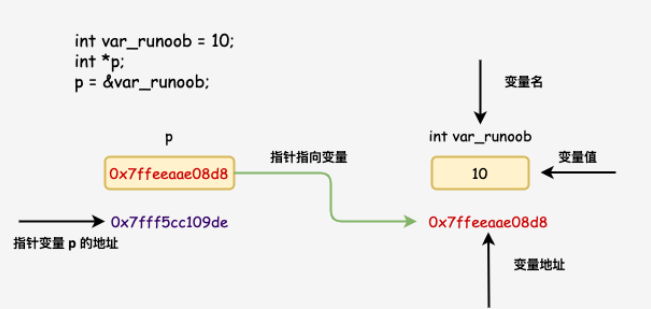
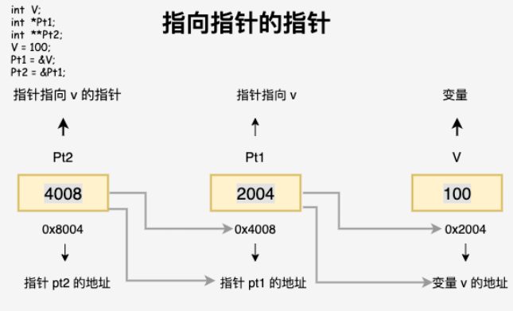

`指针` `有则值无则指针` `类型相同才能赋值`
--

`动态内存分配没有指针是无法执行的 每一个变量都有一个内存位置 每一个内存位置都定义了可使用 & 运算符访问的地址`



```c
#include <stdio.h>
 
int main (){
    int v1_runoob = 10;
    int *p = 0;
    p = &v1_runoob;

    printf("v1_runoob 地址: %p\n", p);
    return 0;
}
```

`p 是一个指针 存储着变量 v1_runoob 的地址`

`指针 p 的类型必须与变量 v1_runoob 的类型一致 因为整型的指针只能存储整型变量的指针地址`

`指针数组在 C 中非常有用 特别是在处理具有不定数量元素的数据结构时 如动态分配的字符串数组或动态创建的结构体数组`

`什么是指针`
--

`指针也就是内存地址 指针变量是用来存放内存地址的变量就像其他变量或常量一样 您必须在使用指针存储其他变量地址之前对其进行声明`

`指针变量声明的一般形式为` `int *v1` `在这里 int 是指针的基类型 它必须是一个有效的 C 数据类型 v1 是指针变量的名称 声明指针的星号 * 是用来指定一个变量是指针`

`所有实际数据类型 不管是整型、浮点型、字符型 还是其他的数据类型 对应指针的值的类型都是一样的 都是一个代表内存地址的长的十六进制数` `不同数据类型的指针之间唯一的不同是 指针所指向的变量或常量的数据类型不同`

`如何使用指针`
--

`使用指针时会频繁进行以下几个操作 定义一个指针变量、把变量地址赋值给指针、访问指针变量中可用地址的值` `这些是通过使用一元运算符 * 来返回位于操作数所指定地址的变量的值`

`* 解引用运算符运算符用于访问指针指向的值 当对一个指针使用 * 运算符时我们得到该指针所指向的内存位置存储的值` 

`& 取地址运算符运算符用于获取变量的内存地址`

```c
#include <stdio.h>
 
int main (){
    int v1 = 20;  
    int *ip1 = &v1;   
    int **ip2 = &ip1;    
    int ***ip3 = &ip2;

    return 0;
}
```

```c
v1 是最底层的数据存储了一个整数值 
ip1 指向 v1 所以 *ip1 就是 v1 的值 
ip2 指向 ip1 所以 *ip2 是 ip1 的值 即 v1 的地址 而 **ip2 是 v1 的值 
ip3 指向 ip2 所以 *ip3 是 ip2 的值 即 ip1 的地址 **ip3 是 ip1 的值 即 v1 的地址 而 ***ip3 是 v1 的值 

&v1 v1 的地址: 0x17fff6b07f6d4
&ip1 ip1 的地址: 0x17fff6b07f6c8
ip1 v1 的地址: 0x17fff6b07f6d4
*ip1 v1 的值: 20
*&ip1 ip1 地址的值 即 v1 的地址: 0x17fff6b07f6d4
&*ip1 ip1 值的地址 即 v1 的地址: 0x17fff6b07f6d4
```

`C 中的 NULL 指针`
--

`在变量声明的时候如果没有确切的地址可以赋值 为指针变量赋一个 NULL 值是一个良好的编程习惯 赋为 NULL 值的指针被称为空指针` 

`NULL 指针是一个定义在标准库中的值为零的常量`

```c
#include <stdio.h>
 
int main (){
    int  *p = NULL;
    printf("p 的地址: %p\n", p);
    return 0;
}
```
`p 指向的地址是 0x10` `在大多数的操作系统上 程序不允许访问地址为 0 的内存 因为该内存是操作系统保留的 然而 内存地址 0 有特别重要的意义 它表明该指针不指向一个可访问的内存位置 但按照惯例 如果指针包含空值零值 则假定它不指向任何东西` 

`如需检查一个空指针 您可以使用 if 语句` `if(p)` `if(!p)`

`指针的算术运算`
--

`C 指针是一个用数值表示的地址 因此您可以对指针执行算术运算` `可以对指针进行四种算术运算` `++` `--` `+` `-` 

`指针的每一次递增 它其实会指向下一个元素的存储单元`

`指针的每一次递减 它都会指向前一个元素的存储单元` 

`指针在递增和递减时跳跃的字节数取决于指针所指向变量数据类型长度 比如 int 就是 4 个字节` 

`p++`

`假设 p 是一个指向地址 1000 的整型指针是一个 32 位的整数 让我们对该指针执行下列的算术运算 在执行完上述的运算之后 p 将指向位置 1004 因为 p 每增加一次 它都将指向下一个整数位置 即当前位置往后移 4 字节 这个运算会在不影响内存位置中实际值的情况下 移动指针到下一个内存位置` 

`如果 p 指向一个地址为 1000 的字符 上面的运算会导致指针指向位置 1001 因为下一个字符位置是在 1001` 

`> 递增指针`

`递增一个指针意味着让指针指向下一个内存位置` `指针的递增操作会根据指针所指向的数据类型进行适当的内存偏移` 

`我们喜欢在程序中使用指针代替数组 因为变量指针可以递增而数组不能递增 数组可以看成一个指针常量` 

`下面的程序递增变量指针 以便顺序访问数组中的每一个元素`

```c
#include <stdio.h>
const int MAx1 = 3;
int main (){
    int arr[] = { 10, 100, 200 };
    int i = 0;
    int *p = 0;

    p = arr;

    for (i = 0; i < MAx1; i++){
        printf("存储地址：arr[%d] = %p  存储值：arr[%d] = %d\n", i, p, i, *p);
        p++;
    }
    return 0;
}
```

`! 递增结构体指针`

```c
#include <stdio.h>

struct Point{ int x1; int z1; };

int main() {
    struct Point points[] = { {1, 2}, {3, 4}, {5, 6} };
    struct Point *p = points;

    printf("初始点: %d, %d\n", p->x1, p->z1);

    p++;

    printf("递增后点: %d, %d\n", p->x1, p->z1);

    return 0;
}
```

`在这个示例中 p++ 使指针从 points[0] 指向 points[1] 因为 p 是一个 struct Point 类型指针 所以它递增时会移动 sizeof(struct Point) 8 个字节` 

`指针的比较`
--

`在 C 语言中 可以比较指针来确定它们的关系 指针比较主要用于确定两个指针是否指向相同的内存位置或确定一个指针是否位于另一个指针之前或之后` `指针可以用关系运算符进行比较  ==、!=、<、>、<=、>=`

```c
#include <stdio.h>
 
int main() {
    int v1 = 5, v2 = 10;
    int *p1 = &v1, *p2 = &v1, *p3 = &v2;

    if(p1 == p2){
        printf("*&p1 == *&p2\n");
    }

    return 0;
}
```

`如果 p1 和 p2 指向两个相关的变量比如同一个数组中的不同元素则可对 p1 和 p2 进行大小比较`

```c
#include <stdio.h>

int main() {
    int arr[] = {10, 20, 30, 40, 50};
    int *p1 = &arr[1]; 
    int *p2 = &arr[3]; 

    if (p1 < p2) {
        printf("&p1 < &p2\n");
    }

    return 0;
}
```

`> 遍历数组并比较指针`

```c
#include <stdio.h>

int main() {
    int arr[] = { 10, 20, 30, 40, 50 };
    int *start = arr;          
    int *end = &arr[4];   
    int *p;

    for (p = start; p <= end; p++) {
        printf("当前指针指向的值: %d\n", *p);
    }

    return 0;
}
```

`指针数组`
--

`C 指针数组是一个数组 其中的每个元素都是指向某种数据类型的指针` `指针数组存储了一组指针 每个指针可以指向不同的数据对象` `指针数组通常用于处理多个数据对象 例如字符串数组或其他复杂数据结构的数组` 

`在这里 把 p 声明为一个数组 由 MAX 个整数指针组成 因此 p 中的每个元素 都是一个指向 int 值的指针`

```c
#include <stdio.h>
const int MAX = 3;

int main ()
{
   int  arr[] = { 10, 100, 200 };
   int i = 0;
   int *p[MAX]; --可变大小的对象可能无法初始化
 
   for(i = 0; i < MAX; i++){
      p[i] = &arr[i];
   }
   for(i = 0; i < MAX; i++){
      printf("arr[%d] = %d\n", i, *p[i]);
   }
   return 0;
}
```

`可以用一个指向字符的指针数组来存储一个字符串列表`

```c
#include <stdio.h>
const int MAX = 3;
 
int main (){
   const char *arr[] = {
        "XIAOYU",
        "hello world",
        "Git",
   };
 
   for(int i = 0; i < MAX; i++){
      printf("arr[%d] = %s\n", i, arr[i] );
   }
   return 0;
}
```

`指向指针的指针`
--

`指向指针的指针是一种多级间接寻址的形式 或者说是一个指针链 通常 一个指针包含一个变量的地址 当我们定义一个指向指针的指针时 第一个指针包含了第二个指针的地址 第二个指针指向包含实际值的位置` 

`一个指向指针的指针变量必须如下声明 即在变量名前放置两个星号` `当一个目标值被一个指针间接指向到另一个指针时 访问这个值需要使用两个星号运算符`

`*p 是完成一次开门取东西操作最终取出来的东西` 

`**p 是完成两次开门取物 需要注意的是第一次取得的是第二次要开的门的门牌号或者说地址 然后根据门牌号继续开门取物 所以 *p 或者 **p 一定是取出来的东西 即为数值 而 p 一定是门牌号 即为地址值` 




`传递指针给函数`
--

`C 语言允许您传递指针给函数 只需要简单地声明函数参数为指针类型即可` 

```c
#include <stdio.h>
#include <time.h>
 
void getSecond(unsigned long *p);

int main (){
    unsigned long sec;

    getSecond(&sec);

    printf("seconds: %ld\n", sec);

    return 0;
}

void getSecond(unsigned long *p){
    *p = time( NULL );
    return;
}
```

`> 能接受数组作为参数`

```c
#include <stdio.h>
 
double getAverage(int *arr, int size);
 
int main (){
    int balance[5] = { 1000, 2, 3, 17, 50 };
    double avg;

    avg = getAverage(balance, 5) ;

    printf("Average value is: %f\n", avg);

    return 0;
}

double getAverage(int *arr, int size){
    int i, sum = 0;      
    double avg;          

    for (i = 0; i < size; ++i){
    sum += arr[i];
    }

    avg = (double)sum / size;

    return avg;
}
```

`函数返回指针`
--

`必须声明一个返回指针的函数` `int * function()`

`C 语言不支持在调用函数时返回局部变量的地址 除非定义局部变量为 static 变量` `因为局部变量是存储在内存的栈区内 当函数调用结束后局部变量所占的内存地址便被释放了 因此当其函数执行完毕后 函数内的变量便不再拥有那个内存地址所以不能返回其指针` `除非将其变量定义为 static 变量 static 变量的值存放在内存中的静态数据区不会随着函数执行的结束而被清除故能返回其地址`

`让我们来看下面的函数 它会生成 10 个随机数 并使用表示指针的数组名 即第一个数组元素的地址 来返回它们`

```c
#include <stdio.h>
#include <time.h>
#include <stdlib.h> 
 
int * random(){
    static int r[10];
    int i;

    srand( (unsigned)time( NULL ) );

    for ( i = 0; i < 10; ++i){
        r[i] = rand();
        printf("%d\n", r[i] );
    }

    return r;
}
 
int main (){

    int *p;
    int i;

    p = random();
    for (i = 0; i < 10; i++){
        printf("*(p + [%d]) : %d\n", i, *(p + i));
    }

    return 0;
}
```

`函数指针 指针函数`
--

`函数指针指向函数的指针 指针函数返回值为指针的函数`

`> 函数指针` `函数指针是指向函数的指针变量`

`通常我们说的指针变量是指向一个整型、字符型或数组等变量 而函数指针是指向函数` `函数指针可以像一般函数一样 用于调用函数、传递参数` 

```c
#include <stdio.h>
 
int max(int v1, int v2){
    return v1 > v2 ? v1 : v2;
}
 
int main(void){

    int (* p)(int, int) = & max; --p 是函数指针 & 可以省略
    int v1 = 0, v2 = 0, v3 = 0, v4 = 0;
 
    printf("请输入三个数字:");
    scanf("%d %d %d", &v1, &v2, &v3);

    v4 = p(p(v1, v2), v3); --等价 v4 = max(max(a, b), c)
 
    printf("v1 vs v2 max = : %d\n", v4);
 
    return 0;
}
```

`回调函数`
--

函数指针作为某个函数的参数
函数指针变量可以作为某个函数的参数来使用的，回调函数就是一个通过函数指针调用的函数。

简单讲：回调函数是由别人的函数执行时调用你实现的函数。

以下是来自知乎作者常溪玲的解说：

你到一个商店买东西，刚好你要的东西没有货，于是你在店员那里留下了你的电话，过了几天店里有货了，店员就打了你的电话，然后你接到电话后就到店里去取了货。在这个例子里，你的电话号码就叫回调函数，你把电话留给店员就叫登记回调函数，店里后来有货了叫做触发了回调关联的事件，店员给你打电话叫做调用回调函数，你到店里去取货叫做响应回调事件。